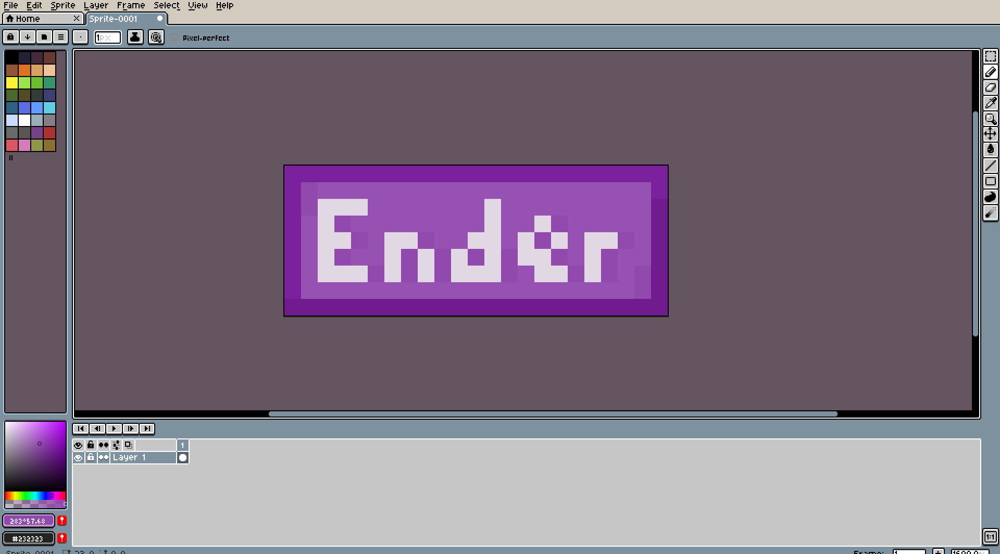
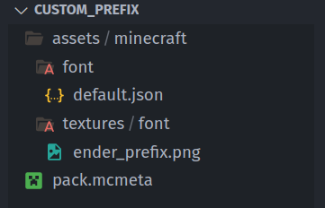
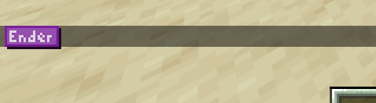
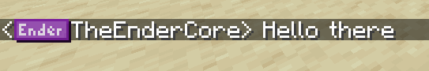

# Making Custom Prefixes

If we want to make a custom prefix for our sever we will need a couple of things.

## Making the assets
First we need to draw the assets.


Now that we have the prefix 

_We need to make a basic recourse pack. If you don't know how to do that u can [Click Here](https://wafflesarebetter.com) for a tutorial._

## Making the font files
And now that that is done. We need to add a font file, it can me named anything, but it probably should be named appropriately to the custom things you are adding.

It should go under the `asset/namespace/font` folder and also move the prefix image `asset/namespace/textures/font`


Now in the font file we should put this peace of json

```json
{
  "providers": [
    {
      "type": "bitmap",
      "file": "minecraft:font/ender_prefix.png",
      "height": 9,
      "ascent": 8,
      "chars": ["\uE000"]
    }
  ]
}
```

Obviously `"file"` key should have the value of the location of the prefix art.<br>
`"chars"` should not be to hard to understand as it is just an array of strings of charter codes. but for now we don't really need to care about it, because we just want to add prefixes.<br>
The `"height"` is for the height of the image, in this case being 9 pixels.<br>
`"ascent"` is the like a vertical slider for how high or low it ir related to normal text<br>

If you want to add more prefixes you would just copy this part:

```json
{
  "type": "bitmap",
  "file": "minecraft:font/ender_prefix_two.png",
  "height": 9,
  "ascent": 8,
  "chars": ["\uE001"]
}
```

And for every next one keep increasing `"\uE000"` & adjust the height and ascent as needed.

Now that that is done its time to see if it works in game.

_Ps. Don't forget to equip the pack, it the nr 1 issue ppl have._

To see the character in game you need to write this command: `/tellraw @s {"text":"\uE000"}` _(Replace the code with the char your testing)_

<br>
Well look at that it, looks pretty cool already.

## Setting up Teams

Now we run the command to create a team `/team add ender_team {"text":"Ender Team"}`<br>
_ender_team is the id of the team and the "text" is the display name of the team and both of these can be changed_

Then we set the team prefix `/team modify ender_team prefix {"text":"\uE000"}`

And join the team `/team join ender_team TheEnderCore`

And Tada! It is done.<br>

